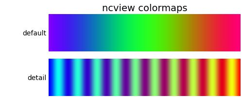

# ncview colormaps for matplotlib

Currently available colormaps from ncview:



## Instal

Clone this repository and copy `ncview_colormap` to your project's
directory

```bash
git clone https://github.com/leifdenby/matplotlib-ncview-colormaps
cp -r matplotlib-ncview-colormaps/ncview_colormap my-project
```

## Usage

python
```
import ncview_colormap

...
plot.plot(..., cmap=ncview_colormap.detail)
```


## Source

- https://github.com/iem-projects/ncview/blob/master/src/

- https://stackoverflow.com/questions/19498169/add-new-colormap-from-file-h-python


Pull-requests for more colormaps welcome :)
